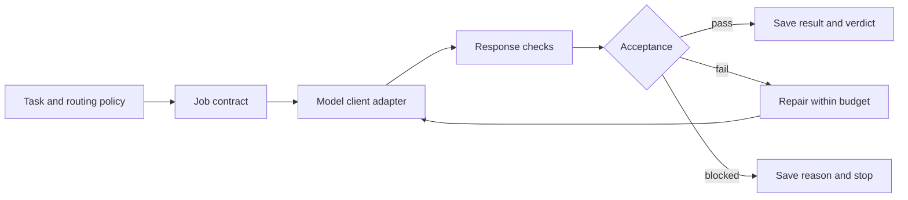

# Conclave

**Coordinate Claude, Codex, Gemini, and Grok from one working session.**

Conclave is a local CLI for delegating LLM tasks, reviewing responses with another model, and comparing recommendations through a council. A lead session sets the goal, assigns work, and combines the results. Conclave handles configured routing, bounded repair, and a record of each job's inputs, attempts, and checks.

I built it to use several models as one working system: give each a defined responsibility, keep the overall objective in one place, and check the output before building on it. It runs through Claude Code, Codex, a Grok CLI, and the Gemini SDK.

Built by [Giovanni Carosso](https://gcarosso.bio), with Claude and Codex. [More tools](https://gcarosso.bio/tools/).

## Why use multiple agents?

A single frontier LLM is a useful baseline. Many tasks fit in one context and need one implementation and a test run. Multi-agent workflows become useful when the work benefits from decomposition, different tools, or another assessment.

| Pattern | Where it helps | Tradeoff |
|---|---|---|
| **Delegation** | Give each worker a bounded task and the context it needs; use a smaller model for routine work | Briefing and integration add calls; poor task boundaries duplicate effort |
| **Parallel work** | Research independent questions or inspect separate components concurrently to reduce elapsed time | Concurrency does not reduce the tokens each worker uses; shared edits need coordination |
| **Review** | Have another LLM check a specific output against the goal and request a repair | Review adds inference cost and can miss the same errors |
| **Council** | Compare separately formed recommendations before a consequential design decision | Useful disagreement costs extra calls; agreement still needs evidence |

The efficiency target is **cost and time per accepted result**. Focused briefs can avoid repeatedly sending a growing conversation to every worker. Smaller models can lower spend on suitable tasks. Reviews, synthesis, and retries can erase those savings, so measure the complete workflow against the single-model baseline. Conclave has no benchmark establishing a quality, latency, or token advantage. [Workflow design and evaluation](docs/workflows.md).

## One goal, one coordinating session

Use a Claude Code or Codex session with shell access to call `ai`, read the job records, and decide the next step. The lead session owns the overall plan and final synthesis; delegated jobs receive explicit briefs. Conclave supplies the CLI and records. Task decomposition and scheduling remain with the lead session or your scripts.

Match the route to the capability the task needs:

- **Complex reasoning and planning → Claude:** work through constraints, compare approaches, and turn findings into a coherent plan.
- **Code changes and test execution → Codex:** inspect the repository, implement a change, and run checks with the configured local sandbox. Conclave uses `codex exec`; it does not provision cloud containers.
- **Video understanding and large-context analysis → Gemini:** interpret audiovisual material or work across substantial source text. Video requires an external Gemini integration; Conclave's current adapter accepts text only.
- **Current web evidence → Grok or a search service:** use Grok's `live` role, or supply findings from an optional service such as Perplexity. Perplexity is not a built-in adapter.

These are useful starting assignments, with overlapping capabilities. The coordinator selects the needed branches, reconciles their findings, and checks one combined result. [Model roles and adapter limits](docs/workflows.md#choose-models-by-role).

Optional tools such as **Firecrawl** can retrieve source pages in parallel for analysis. Perplexity can provide answers backed by web search. Both require host-side integration. Conclave's `consensus` samples run concurrently; its council members run sequentially. [Research tools and coordination](docs/workflows.md#optional-research-tools).

## Quick start

Requires Python 3.9+, Bash 3.2+, and Git on macOS or Linux. The core uses the Python standard library. Install and authenticate the model client you plan to use; Gemini additionally requires `google-genai` and an API key.

```bash
mkdir -p ~/hub && cd ~/hub
git clone https://github.com/gcarosso/conclave _system
_system/install.sh --init

# Preview routing without a model call.
cd work
../_system/router/ai scout "Summarize the files in this directory" --dry-run

# Run with an installed, authenticated client.
../_system/router/ai scout "Summarize the files in this directory" --vendor codex
```

The installer also links `ai` into `~/.local/bin`. Add that directory to `PATH` to use the shorter command. Configure model IDs and role defaults in `router/policy.json`; routing uses this policy and does not discover installed clients automatically. See [installation](docs/install.md).

## Execution and acceptance



A standard job writes `contract.json`, `events.jsonl`, an `attempts/` directory, `result.md`, `verdict.json`, and `acceptance.json`. Its final status is `pass`, `fail`, or `blocked`. Exit code 0 means its declared checks passed.

By default, `scout` checks only that the response contains more than 20 characters after trimming outer whitespace. `write` and `code` also request a structured review from another LLM provider. Acceptance is therefore as informative as the checks and evidence supplied. For code changes, the response review does not establish that the resulting repository builds or passes tests. [Architecture and limits](docs/architecture.md#enforcement-boundary).

## Commands

| Command | Behavior |
|---|---|
| `ai scout "task"` | Tier-1 lookup or summary |
| `ai plan "task"` | Tier-2 analysis or implementation plan |
| `ai code "task"` / `ai write "task"` | Tier-2 execution with review, bounded repair, and conditional escalation |
| `ai review "target"` | Review a named target |
| `ai auto "task"` | Classify role, tier, and review need before running |
| `ai council "question"` | Two separate recommendations; optional judge on disagreement |
| `ai consensus "question" --options "A;B"` | Aggregate 3–10 samples across LLMs and prompt framings |
| `ai roles` / `ai jobs` / `ai smoke` | List routing defaults, inspect recent jobs, or test tier-1 connectivity |

Council and consensus produce decision-support records with their own statuses. Agreement is not a correctness metric. Model tiers are configured choices; Conclave does not estimate task difficulty, quality, or price from a benchmark. [Command reference](docs/usage.md).

## Package components

| Component | Purpose |
|---|---|
| `router/` | CLI, routing, contracts, checks, adapters, and job records |
| `shared/` | Example governance for workspace domains and vendor eligibility |
| `gate/` | Regex marker scans over files, staged blobs, and Git history; optional hooks |
| `registry/` | Local capability inventory with dated probe results |
| `ops/` | Status rendering, registry audit, and manual handoffs |
| `coordination/`, `skills/`, `agents/` | Coordination protocol and Claude Code integrations |

The expected layout is `<hub>/_system/` for this checkout, alongside domain folders such as `work/` and `public/`. A domain groups files and instructions for one area of work. The router checks vendor eligibility; filesystem restrictions depend on the adapter and host configuration.

## Documentation

- [Install](docs/install.md) and [usage](docs/usage.md)
- [Configuration](docs/configuration.md) and [architecture](docs/architecture.md)
- [Multi-agent workflows](docs/workflows.md), [design rationale](docs/concepts.md), and [component reference](docs/tools.md)
- [Troubleshooting](docs/troubleshooting.md), [example job records](examples/README.md), and [security scope](SECURITY.md)

```bash
make test   # offline router tests, publication-gate fixtures, and docs link check
make e2e    # temporary hub driven through the real `ai` CLI with fake claude and codex CLIs
make lint   # Python compilation; ShellCheck when installed
```

The CI workflow is configured for Linux and macOS. Offline tests exercise routing and control logic with a fake adapter; they do not establish live model compatibility or a quality improvement from review. [Contributing](CONTRIBUTING.md).

## License

[Apache 2.0](LICENSE).
