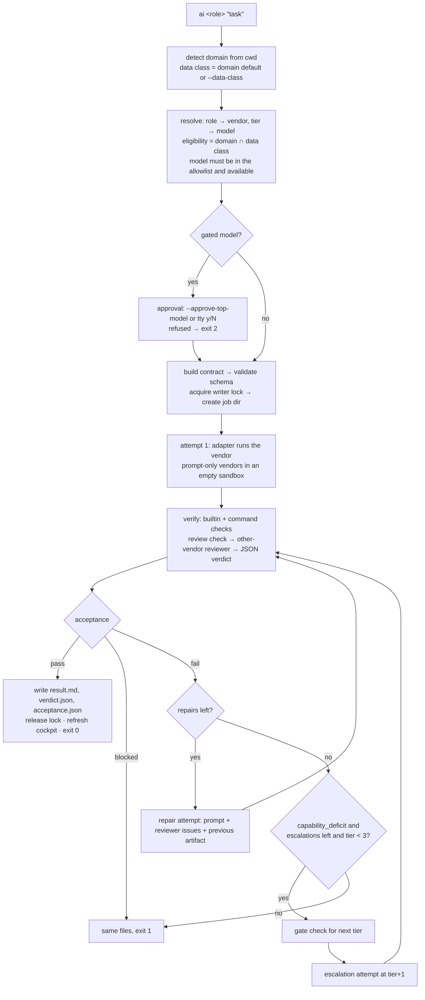

# Architecture

## The shape

```
<hub>/
  <domain>/                  a context envelope; a session works in exactly one
    CLAUDE.md AGENTS.md      generated: scope, data class, eligible vendors
    .claude/settings.json    generated: deny rules for every sibling domain
    .ai/jobs/<id>/           job records (the protocol)
    .ai/jobs/locks/          writer locks
  _system/                   this repository
    shared/governance.json   canonical rules → generator → every instruction file
    router/                  ai (CLI) → kernel → adapters → vendor CLIs / SDK; verify → verdict
    gate/                    publish gate + hooks
    registry/                probes → registry.json → REGISTRY.md
    ops/                     cockpit, handoffs, audit
  CROSS-DOMAIN.md STATUS.md  generated / rendered
```

The router is four files with a strict dependency direction:

```
ai ──▶ kernel ──▶ adapters   (the only place a vendor is invoked)
        │
        └──────▶ verify      (checks, review prompt, acceptance decision; no vendor calls)
```

`kernel.py` never shells out except through `adapters.run`; `verify.py` never calls a vendor at all (the kernel hands it a reviewer callable). That is what lets the whole suite run offline with a fake `adapters.run`.

## How a job flows



Every box that changes state appends to `events.jsonl`. Every attempt, including reviewer calls, has its own directory under `attempts/` with the exact request and the raw output.

## Job-folder anatomy

| File | Written by | Schema |
|---|---|---|
| `contract.json` | kernel, before any vendor runs; rewritten only to add an escalation approval | `router/contract.schema.json` |
| `events.jsonl` | kernel, append-only | `{at, event, …}` |
| `attempts/<n>/request.json` | kernel | purpose, vendor, model, tier, cwd, prompt |
| `attempts/<n>/result.json` | adapter envelope | execution_status, exit_code, tokens, cost, elapsed, error |
| `attempts/<n>/result.md`, `stdout.txt`, `stderr.txt`, `review-raw.txt` | kernel / verify | raw text; `<n>` is `1`, `2`, … for work, repair and escalation attempts and `1-review-<vendor>` for the reviewer call that judged attempt 1 |
| `verdict.json` | verify | `router/verdict.schema.json` |
| `acceptance.json` | kernel (`finalize`) | acceptance_status, execution_status, artifact sha256, checks, attempts |
| `result.md` | kernel | the final artifact |

The verdict carries the SHA-256 of the artifact it judged, so a later edit to `result.md` is detectable (`ai accept` recomputes).

## Contract

```json
{
  "version": 1, "id": "20260914T231501123456Z-write", "domain": "work", "data_class": "private",
  "goal": "Rewrite docs/summary.md …", "role": "write",
  "inputs": [], "outputs": ["result.md"],
  "scope": {"read": ["<hub>/work"], "write": ["<hub>/work"], "effects": ["edit-files"], "writer": "claude/claude-sonnet-5"},
  "authorization": {"source": "cli", "declassification": null, "top_model_approval": null},
  "limits": {"calls": 6, "seconds": 900, "repairs": 1, "escalations": 1, "review_max_chars": 80000},
  "checks": [
    {"id": "nonempty", "kind": "builtin", "rule": "nonempty"},
    {"id": "goal-met", "kind": "review", "rule": "The artifact accomplishes the goal; claims are supported; nothing required is missing"}
  ]
}
```

`scope.write` for a read-only role is just `result.md`; for a writing role it is the domain directory. The writer lock hashes the sorted write set, so two `code` jobs in the same domain serialize and a `scout` never blocks anyone.

## Verdict

```json
{
  "version": 1, "job_id": "…", "artifact_sha256": "…",
  "reviewer": {"vendor": "codex", "model": "gpt-5.6-sol"},
  "execution_status": "succeeded", "acceptance_status": "fail",
  "checks": [
    {"id": "nonempty", "status": "pass", "evidence": "artifact length 812"},
    {"id": "goal-met", "status": "fail", "evidence": "\"three outcomes\" — only two are quantified"}
  ],
  "issues": [
    {"id": "R1", "severity": "major", "problem": "third outcome has no number", "fix": "add the measured value", "capability_deficit": false}
  ]
}
```

## Enforcement boundary

Be precise about what is enforced and how. Eligibility is not isolation.

| Control | Enforced by | Kind |
|---|---|---|
| Vendor eligibility per domain and data class | kernel `resolve` | technical, for jobs through `ai` |
| Model allowlist and availability | kernel `resolve` | technical, for jobs through `ai` |
| Top-model approval | kernel `gate_check`, recorded in the contract | technical, for jobs through `ai` |
| Timeouts, turn budgets, call/repair/escalation limits | kernel + adapters | technical, for jobs through `ai` |
| One writer per write set | kernel lock file | technical, for jobs through `ai` |
| Acceptance from declared checks | verify | technical, for jobs through `ai` |
| Prompt-only vendors get no working directory | kernel `attempt` | technical |
| Claude Code cannot read or write sibling domains | generated `.claude/settings.json` deny rules | **technical** (Claude Code honors deny rules) |
| Codex cannot write outside the domain | `codex exec -s read-only\|workspace-write -C <domain>` | technical (write); **behavioral** (read: `AGENTS.md` instructions) |
| Grok / Gemini see only the prompt | empty sandbox; API receives text only | technical by construction |
| A desktop chat or a raw vendor CLI in the same shell | generated instruction files only | **behavioral** |
| No private marker in a public repo | publish gate in tree, pre-commit and pre-push modes | technical, fail-closed, for hooked repos |

The honest summary: the router enforces everything it launches; instruction files govern everything else. Canary files (`.canary-sandbox` in private domains) exist so a session can verify from the public side that the deny rules hold: if you can read one from a public-domain session, stop and report.

## Vendor adapters

Each adapter is one function `(model, prompt, cwd, timeout, …) → envelope`:

| Vendor | Invocation | Structured output | Sandbox |
|---|---|---|---|
| claude | `claude -p --model M --output-format json --max-turns N [--settings <domain>/.claude/settings.json] [--json-schema …]` | `--json-schema` | domain deny rules via `--settings` |
| codex | `codex exec -m M -s <read-only\|workspace-write> -C <cwd> --ephemeral --json -o <file> [--output-schema …]` | `--output-schema` | `-s` mode; network only when the contract's effects include it |
| grok | `grok --model M --cwd <sandbox> --max-turns N --always-approve --output-format json [--disable-web-search] --single "…"` | `--json-schema` | empty sandbox dir; web search only for `live` |
| gemini | `python3 -c <snippet>` using `google.genai` | none (text) | API; prompt only |

The envelope normalizes `execution_status`, `exit_code`, `text`, `session_id`, `input_tokens`, `output_tokens`, `cost_usd`, `billing`, `elapsed_s`, `error`, plus raw stdout/stderr. Adding a vendor is one function, a `run()` branch, models and a ladder in `policy.json`, and a name in `governance.vendors`.

## Governance generation

`generate.py` is pure: `targets(g)` returns `{path: content}` for every generated file; `--write` writes them, `--check` diffs them against disk and exits 1 on drift. The tests generate into a temp hub and assert zero drift, then hand-edit a file and assert the drift is reported by relative path.

## Publish gate modes

| Mode | Scans | Used by |
|---|---|---|
| `publish-gate.sh <path>` | every file in the tree: git tracked + untracked-not-ignored (dotfiles included), or `find` for non-git trees; binaries ≤ 5 MB via `strings` | manual checks, publish pipelines |
| `--staged <repo>` | added lines in the staged index, plus binaries added or modified | pre-commit hook |
| `--diff <repo> [A..B]` | added lines in **every commit** of the range (not the net diff), plus binaries; default range `@{push}..HEAD` then `@{upstream}..HEAD`; no range resolvable → **blocked** | pre-push hook (which computes the right range per pushed ref, including first pushes) |

Outcomes are exactly two: `PUBLISH GATE: clean (<mode>, <repo>)` with exit 0, or `PUBLISH GATE: BLOCKED — <reason>` with exit 1. Reasons include markers found, scan error, git error, unresolvable range, missing or empty markers file, invalid regex.

## Design decisions

- **Files, not a service.** No daemon, no database, no queue. A job is a directory; the index is a JSONL file; the lock is `O_EXCL`. This is enough at the scale of one person or one team, and it is what makes every state inspectable with `ls` and `cat`.
- **The worker never grades itself.** Acceptance is computed by `verify.py` from the contract's checks. A worker's "ACCEPTED" in its text is ignored; the test suite has a case for exactly that.
- **Fall through on execution failure, never on judgment.** If the preferred reviewer cannot run (auth, timeout, empty output), the next eligible vendor reviews. If the reviewer runs and says fail, that is the verdict.
- **Escalate on the reviewer's word, not on failure.** A repair fixes corrections; only `capability_deficit` justifies a more expensive model, and only with approval.
- **Publish is not a role.** Nothing in `policy.json` can route a job into a public domain; publication is a hub-root action with the gate first. The test suite pins this.
- **Everything the tests need is in the repo.** The suite builds its hub from `governance.example.json` in a temp dir; CI does a real `ai init` in a temp hub and drift-checks it on Linux and macOS.

## Extending

| To add… | Touch |
|---|---|
| a vendor | `adapters.py` (one function + `run` branch, `PROMPT_ONLY_VENDORS` if applicable), `policy.json` (models, ladder), `governance.json` (vendors), tests |
| a role | `policy.json` roles; `ROLE_PROMPT` in `ai` for a system prompt |
| a builtin check | `verify.run_builtin` |
| a governance rule | `governance.json` rules (any key renders); the generator's `KNOWN_RULES` if it needs a fixed position |
| a cockpit section | `ops/cockpit.sh` (facts first, then the attention derivation) |
| a registry probe | `registry/config.json` `extra_commands`, or a section function in `registry/generate.py` |
