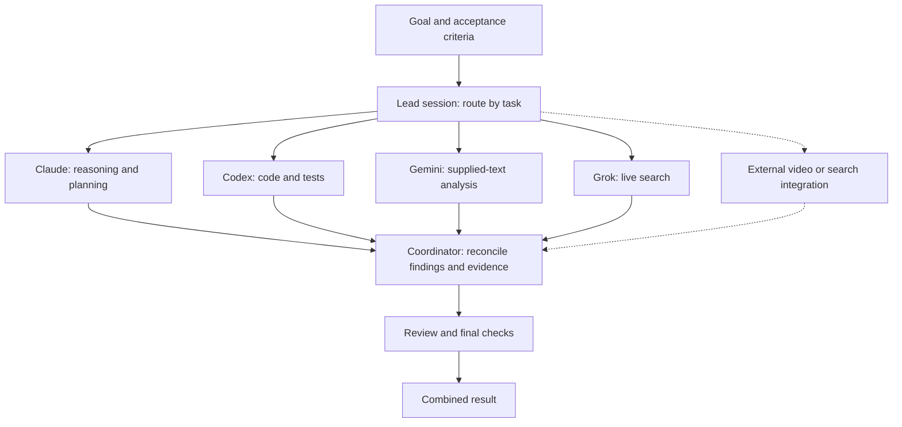

# Multi-agent workflows

A useful division of labor gives each agent a specific contribution to one goal. The coordinator decides what to delegate, supplies the relevant context, and checks that the results fit together. Conclave provides job execution and records for this pattern; the coordinating session or script supplies the workflow.

## Performance, tokens, and cost

Evaluate three outcomes separately:

- **Quality:** does the final artifact meet the task's requirements? A second model may find an omission or propose a better approach. It can also repeat the first model's mistake.
- **Latency:** independent searches or analyses can run concurrently. Completion time then depends on the slowest branch plus coordination and synthesis. Dependent work still has to wait.
- **Efficiency:** small briefs and compact findings can keep irrelevant history out of worker contexts. Routing routine tasks to smaller models may reduce cost. Every additional worker, review, and repair consumes tokens.

For one batch of independent workers, a rough accounting is:

```text
total tokens = coordinator + all workers + reviews + repairs
elapsed time ≈ coordination + slowest worker + review, repair, and integration
```

Count input and output tokens across every call, including repeated context. Dollar cost also depends on model pricing, caching, and tool charges. A shorter wall time, a smaller coordinator context, and a lower bill are different results.

Start with one capable model using the same tools and checks. On representative tasks, compare final quality, elapsed time, total tokens, and cost per accepted result. Add delegation where this comparison justifies it. Tight dependencies, small tasks, and repeated edits to the same files often favor one agent. Conclave records client-reported usage where available, but does not optimize routing from evaluations or enforce a global token or dollar budget.

Anthropic's [multi-agent research account](https://www.anthropic.com/engineering/multi-agent-research-system) describes why parallel exploration and separate contexts helped its research workload, alongside substantial token overhead. Those results concern that system and evaluation; they are not measurements of Conclave.

## Choose models by role

Start with the task's requirements: video input, complex reasoning, executable code, or current sources. Then select a model and environment that provide the required input format, tools, and permissions. Claude and Gemini name model families; Codex is an agent environment backed by OpenAI models. These are starting assignments to evaluate on your workload:

| Model or environment | Useful contribution | Current Conclave interface |
|---|---|---|
| **Claude / Claude Code** | Complex reasoning, planning, and synthesis: evaluate constraints, compare designs, and reconcile findings. Claude supports [reasoning for complex tasks](https://platform.claude.com/docs/en/build-with-claude/extended-thinking); [Claude Code](https://code.claude.com/docs/en/overview) adds file and command tools. | CLI adapter; the default planning and writing roles use Claude. A host Claude session can coordinate other jobs. |
| **OpenAI / Codex** | Implementation, debugging, and executable checks: inspect code, make changes, and use test results to guide repair. Local execution has configurable [sandbox and approval controls](https://learn.chatgpt.com/docs/agent-approvals-security). | Local `codex exec`; code and review roles use different sandbox settings. Conclave does not create Codex cloud containers. A host Codex session can also coordinate. |
| **Gemini** | [Video understanding](https://ai.google.dev/gemini-api/docs/video-understanding), including audiovisual events and timestamps, and [large-context analysis](https://ai.google.dev/gemini-api/docs/long-context) across supplied documents. | Prompt text through the Gemini SDK. Video, other multimodal input, file upload, and search grounding require separate integration. Supply relevant text explicitly. |
| **Grok** | Current-source research when search tools are enabled; another model's recommendation for council or review. xAI documents a web-search tool. [Docs](https://docs.x.ai/developers/tools/web-search). | Local Grok CLI; web search is enabled for `live` only. Available search behavior depends on that CLI and its configuration. |
| **Perplexity, optional** | Answers supported by current web sources through [Sonar](https://docs.perplexity.ai/docs/sonar/quickstart). Useful for gathering evidence before planning or review. | No built-in adapter. Invoke it from the host environment and pass relevant findings and citations into jobs. |

For example, a task based on a recorded technical demo could use an external Gemini video call to extract timestamped observations, Grok or Perplexity to check current documentation, Claude to turn that evidence into an implementation plan, and Codex to build and test it. Text findings return to the coordinator for integration. This is a workflow you assemble around Conclave; the video and Perplexity calls need their own integrations.

These strengths overlap. Claude can implement code, Codex can plan, and other models can analyze documents. Assignments should follow observed results, tool access, and cost. Use only the branches the task needs.

Different LLMs can contribute different approaches, but provider diversity alone is not evidence of independent errors or higher accuracy. In configuration and CLI flags, `vendor` remains the adapter selector: `claude`, `codex`, `gemini`, or `grok`.

## Coordinate from one session

The coordinator selects the needed branches and combines their outputs. Dashed edges show optional external integrations. Conclave does not automatically execute this graph.



Keep a short working plan in the coordinating session and on disk. Each delegated brief should identify:

1. The overall goal and the worker's specific task.
2. Relevant inputs, source requirements, and permitted tools.
3. File ownership, dependencies, and stop conditions.
4. Expected output, acceptance checks, and evidence to return.

Workers return compact findings with source or artifact references. The coordinator inspects them, resolves disagreements, and verifies the combined result. Parallelize independent reads; give each shared file set one writer. Conclave's CLI write scope can be domain-wide, so prose task boundaries do not create separate locks or permissions.

The lead session can invoke `ai` through its shell tool and inspect `.ai/jobs/`. Child calls have their own contexts; Conclave does not synchronize desktop conversations or forward the lead session's full history. `consensus` has built-in concurrent sampling. General task scheduling and dependency handling belong to the host session or script. See [usage](usage.md) and the [coordination protocol](../coordination/PROTOCOL.md).

## Optional research tools

Perplexity's [Sonar API](https://docs.perplexity.ai/docs/sonar/quickstart) combines web search with an answer and source references. A coordinator can use it to gather current evidence and pass the cited findings to another model for analysis. Conclave has no Perplexity adapter; this call belongs to the host session or an external script.

Firecrawl is one option for collecting web evidence. Its [search endpoint](https://docs.firecrawl.dev/features/search) returns result metadata and can retrieve page content. [Batch scraping](https://docs.firecrawl.dev/features/batch-scrape) processes a supplied URL list concurrently. An external coordinator can issue independent search queries in parallel, subject to service limits, then deduplicate and batch-fetch selected pages.

A practical research sequence is:

1. Divide the question into distinct topics or source sets.
2. Retrieve pages through a host tool, CLI, MCP server, or script.
3. Give each analysis worker relevant excerpts with URLs and retrieval dates.
4. Return concise findings, citations, and unresolved contradictions to the coordinator.

Batch retrieval can reduce waiting without adding another reasoning agent. Use separate agents when the branches require their own search decisions or analysis. Retain the retrieved evidence so reviewers can check summaries without repeating every search.

External retrieval and video analysis have their own requests and charges, outside Conclave's call budget. Supply their relevant outputs as text, retaining source URLs or video timestamps. Naming a local file or video in a Gemini job prompt does not attach it.

## Delegation, review, and council

Delegation partitions work. Review evaluates a particular output. A council spends additional inference on the same decision to expose alternatives and disagreements. Use a council for questions such as an architecture choice with competing constraints; use delegation for independent work that must be completed.

[Andrej Karpathy's LLM Council](https://github.com/karpathy/llm-council) is a useful example: models first answer separately, then rank anonymized responses, and a chair synthesizes the result. Conclave's `council` uses two separate recommendations and an optional judge on disagreement. It does not implement that peer-ranking stage. Its `consensus` command instead aggregates concurrent samples across models and prompt framings.

Keep the reasons and evidence behind a recommendation. Agreement, reviewer approval, and an executable test provide different kinds of evidence; use checks appropriate to the final artifact. [Evaluation and acceptance](concepts.md).
